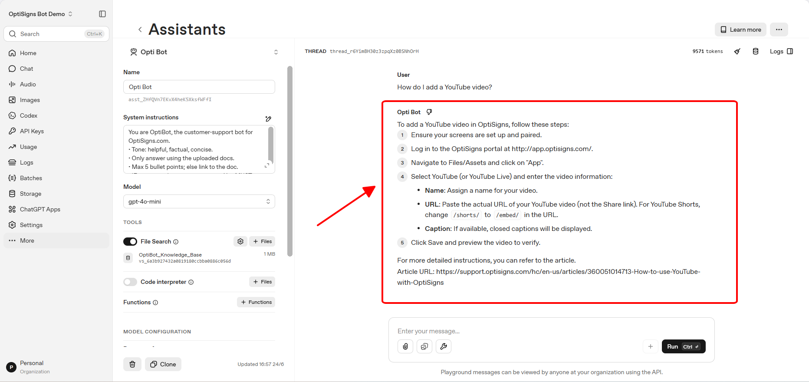

# OptiBot Knowledge Pipeline

Daily scraper/uploader for the OptiBot mini-clone take-home test. The job pulls OptiSigns Help Center articles from the Zendesk API, converts article HTML into clean Markdown, chunks content by headings, and uploads only new or updated chunks to an OpenAI Vector Store.

## Setup

```bash
python -m venv venv
venv\Scripts\activate
pip install -r requirements.txt
copy .env.example .env
```

Set `OPENAI_API_KEY` in `.env`. Optional settings:

- `VECTOR_STORE_NAME`: OpenAI Vector Store name. Defaults to `OptiBot_Knowledge_Base`.
- `ZENDESK_ARTICLES_URL`: Zendesk Help Center article API URL.

## Run Locally

Initial Markdown export:

```bash
python scraper.py
```

Upload existing Markdown files to a Vector Store:

```bash
python upload_vector.py
```

Daily delta job:

```bash
python main.py
```

Docker:

```bash
docker build -t optibot-pipeline .
docker run --rm -e OPENAI_API_KEY=sk-your-openai-api-key optibot-pipeline
```

## Chunking Strategy

Each article is saved as one Markdown file with the article title as `# Heading` and the source `Article URL` appended at the bottom. Before conversion, the scraper removes common nav/ad/noisy HTML elements such as `nav`, `aside`, `footer`, `header`, scripts, forms, ad containers, breadcrumbs, sidebars, related articles, and voting widgets.

Chunks are split on `##` and `###` headings. Every chunk repeats the article title and keeps the `Article URL` footer so File Search responses can cite the original support article.

## Daily Job Logs

TODO: Add DigitalOcean daily job logs link or last-run artifact after deployment.

## Playground Screenshot



The screenshot above shows OptiBot answering "How do I add a YouTube video?" with numbered steps and a cited `Article URL`, which is the exact sanity check requested in the take-home.
